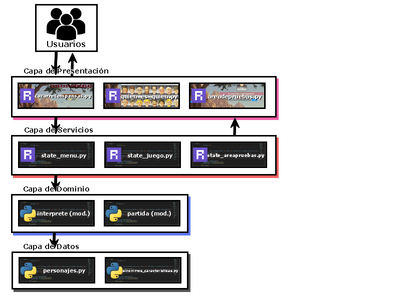
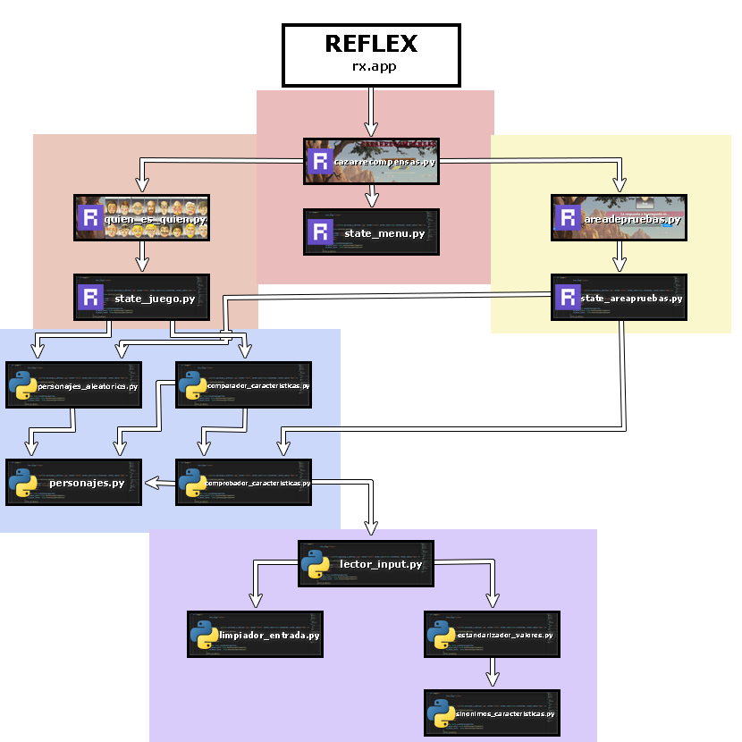
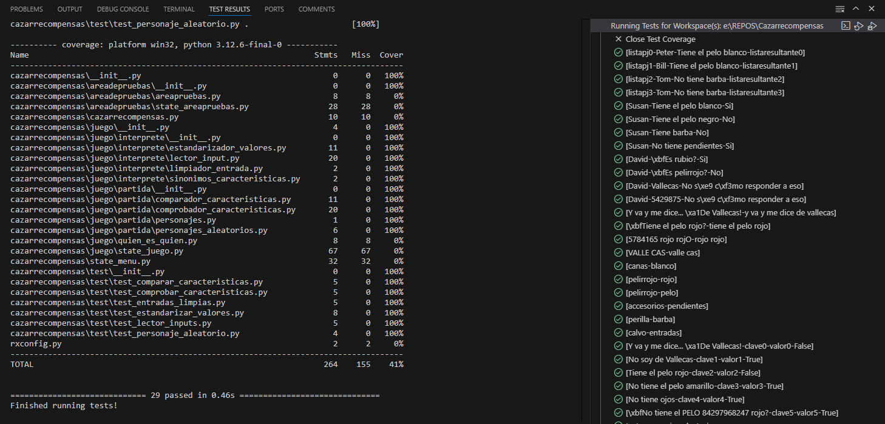
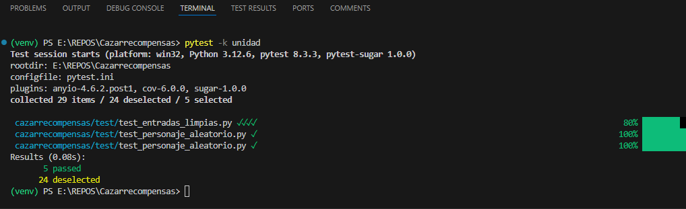
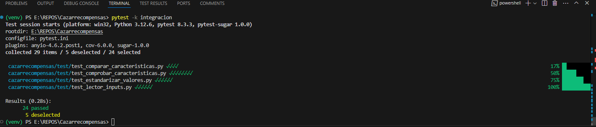
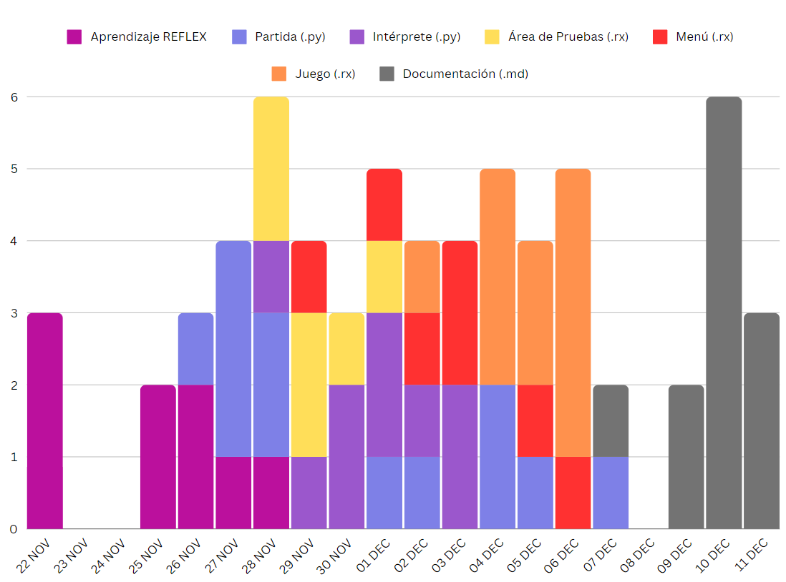
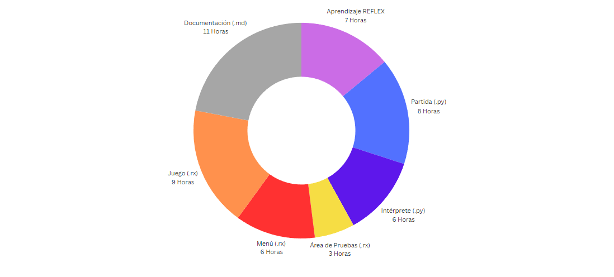
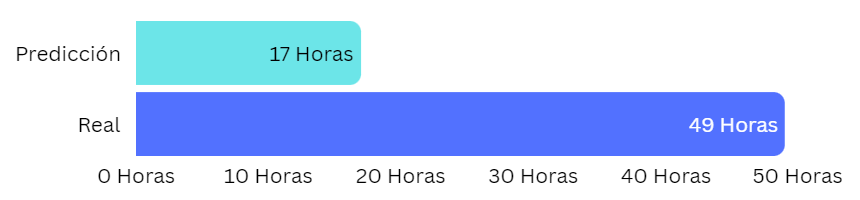

# Cazarrecompensas (Quién es Quién)


## Tabla de Contenidos
1. [Introducción](#introducción)
2. [Manual](#manual)
3. [Pre-requisitos](#pre-requisitos)
4. [Instalación](#instalación)
5. [Uso](#uso)
6. [Metodología](#metodología)
7. [Descripción técnica](#descripción-técnica)
8. [Requisitos funcionales, no funcionales y NOT LIST](#requisitos-funcionales-no-funcionales-y-not-list)
9. [Casos de Uso](#casos-de-uso)
10. [Arquitectura de la aplicación](#arquitectura-de-la-aplicación)
11. [Diseño](#diseño)
12. [Diagrama de Componentes](#diagrama-de-componentes)
13. [Implementación](#implementación)
14. [Tecnologías y Herramientas utilizadas](#tecnologías-y-herramientas-utilizadas)
    - [Backend](#backend)
    - [Frontend](#frontend)
15. [Pruebas](#pruebas)
    - [Coverage](#coverage)
    - [Test de unidad](#test-de-unidad)
    - [Test de integración](#test-de-integración)
16. [Análisis del tiempo invertido](#análisis-del-tiempo-invertido)
    - [Gráfico conjunto (Wakatime)](#gráfico-conjunto-wakatime)
    - [Justificación temporal](#justificación-temporal)
17. [Conclusiones](#conclusiones)
18. [Posibles mejoras](#posibles-mejoras)
19. [Dificultades](#dificultades)

---

## Introducción
Cazarrecompensas es publicado por [MMSS99](https://github.com/MMSS99) y [Desteveco](https://github.com/Desteveco) como resultado del proyecto [*Quien es Quién*](https://github.com/dfleta/death-march) al estilo *death march*, a evaluar durante la 1º evaluación del *CS de Desarrollo de Aplicaciones Multiplataforma* (IES TEIS, 2024-2025). 

**El proyecto está escrito enteramente en [Python 3.12.6](https://www.python.org), haciendo uso del framework [Reflex](https://reflex.dev)** para los eventos que controlan la lógica, la representación visual y la ejecución de la aplicación. 

# Manual


## Pre-requisitos
- `Python3`
- `Git`
- `pip3`


## Instalación
Recomendamos utilizar un entorno virtual para instalar y manejar las dependencias del programa.
1. Abre una terminal en la carpeta donde desees descargar el juego. Desde ella, clona el repositorio, que creará su propia carpeta *Cazarrecompensas*.
```
PS git clone https://github.com/MMSS99/Cazarrecompensas.git
```
2. Entra a la carpeta *Cazarrecompensas*, crea un entorno virtual de Python, actívalo e instala los [requerimientos](requirements.txt).
```
PS cd Cazarrecompensas
PS py -m venv venv
PS .\venv\Scripts\activate
(venv) PS pip install -r requirements.txt
```
3. Inicializa Reflex y lánzalo: el juego se ejecutará como una página localhost, cuya dirección aparecerá en la terminal.
```
(venv) PS reflex init
(venv) PS reflex run
```


## Uso
*Cazarrecompensas* presenta una interfaz gráfica intuitiva y fácilmente navegable basada en eventos Reflex. Un usuario que quiera jugar una partida seguirá los siguientes pasos:

- **1. Hará click sobre el botón *'Nueva Partida'.***

<sub>(La lógica de la aplicación iniciará una nueva partida, aleatorizando el tablero de juego y **escogiendo un personaje aleatorio** que servirá de condición de victoria para el jugador)</sub>


- **2. Introducirá una pregunta sobre las caracterísitcas de un personaje...**

 ... y hará click sobre el botón comprobar, que eliminará personajes dependiendo de si la característica preguntada se encuentra (o no) entre las características del personaje a buscar.\
<sub>(La aplicación aceptará cualquier entrada. Si ningún personaje cuenta con la característica preguntada ni ningún sinónimo de la misma, la aplicación no mostrará cambios. **El jugador podrá repetir este paso tantas veces como lo desee.**)</sub>

- **3. Hará click sobre el personaje que crea ser la condición de victoria.**

<sub>(La aplicación le mostrará si su adivinanza es correcta o incorrecta, y le permitirá iniciar una nueva partida o retornar al menú)</sub>

# Metodología
Durante los primeros 10 días del desarrollo del proyecto, **adoptamos de forma natural una metodología de desarrollo en cascada**; nuestro desconocimiento sobre Reflex alentó a nuestra decisión de comenzar a construir la aplicación de una forma lineal que nos permitiese preparar la lógica pura en *Python puro* mientras nos documentábamos sobre las posibilidades ofrecidas por Reflex, realizando cambios a nuestro prototipo de diseño pero no implementándolos hasta adquirir un nivel suficiente de competencia para hacerlo de forma cómoda y holgada.  

Con el desarrollo del proyecto acercándose al fin de la fase de implementación, **se nos impuso con obligatoriedad el uso de un marco de trabajo y metodología *Kanban* a través de los [*Projects* de Github](https://github.com/users/MMSS99/projects/1)**, que ralentizó considerablemente el flujo de desarrollo durante una corta fase de adaptación. 

# Descripción técnica


## Requisitos funcionales, no funcionales y *NOT LIST*
### Requisitos funcionales

El usuario podrá esperar...
- **Inicio de partida**: La aplicación creará y mostrará un tablero de juego y escogerá a un personsaje aleatorio que el usuario deberá adivinar. 
- **Interacción via escrita con el juego**: El usuario podrá escribir preguntas a la aplicación y enviarlas, recibiendo una respuesta visual.
- **Finalizar una partida**: Sea por una adivinanza interactuando con el tablero de juego o por la interacción con uno de los componentes de navegación, el usuario podrá finalizar o abandonar una partida cuando lo considere oportuno. 
### Requisitos no funcionales
El usuario podrá disfrutar de...
- **Interfaz intuitiva** que requiere de poca o ninguna explicación para ser utilizada. 
- **Lógica blindada** a prueba de entradas del usuario distintas. 
### NOT LIST
- Funcionalidades multijugador.
- Hosting de la aplicación en red.
- Permanencia de datos, como puntuación. 


## Casos de uso
A continuación aparecerán enlaces a el Proyecto de Github asociado a la aplicación:
- [Caso #1: Iniciar una partida.](https://github.com/MMSS99/Cazarrecompensas/issues/1)
- [Caso #2: Consultar atributos de personaje.](https://github.com/MMSS99/Cazarrecompensas/issues/2)
- [Caso #3: Adivinar un personaje.](https://github.com/MMSS99/Cazarrecompensas/issues/3)
- [Caso #4: Volver al menú](https://github.com/MMSS99/Cazarrecompensas/issues/4)

## Arquitectura de la aplicación


- **Capa de presentación:**
    - Aquí encontramos nuestra página índice (*cazarrecompensas.py*) y las dos páginas de función. **Se encuentran escritas en su totalidad a través de Reflex.**

- **Capa de servicio**
    - Capa dedicada a los *rx.State*, donde se encuentran los event handlers de los distintos eventos que Reflex puede enviar.

- **Capa de dominio**
    - **interprete (Módulo)** se encarga de recibir las entradas de texto de los usuarios, interpretarlas e inyectarlas a la lógica de la partida.
    - **partida (Módulo)** usa la información recibida del *interprete* y la compara con la información guardada en las bases de datos para ejecutar funciones que producen cambios en la partida.

- **Capa de datos**
    - Modulos de Python que sólamente guardan constantes. 

# Diseño


## Diagrama de Componentes


- **Páginas rx.app y rx.State**:
    - `cazarrecompensas.py` / `state_menu.py` (*Rojo*): El índice de las páginas, así como la página de entrada a la aplicación.
    -  `quien_es_quien.py` / `state_juego.py` (*Naranja*): La pantalla de juego, donde ocurre la magia.
    - `areadepruebas.py` / `state_areapruebas.py` (*Amarillo*): Remanente del primer prototipo de la aplicación donde se pueden comprobar características de personajes. Mantenido para futura extensión.
- **Partida *(Azul)***:
    - `personajes_aleatorios.py`: Toma los personajes de `personajes.py` y genera una lista aleatoria con los nombres de todos los personajes, así como uno que pasará a ser la condición de victoria.
    - `comparador_caracteristicas.py`: Compara las características sobre las que pregunta el jugador con el personaje condición de victoria y el resto de personajes.
    - `comprobador_caracteristicas.py`: Comprueba si cada uno de los personajes tiene o no la característica preguntada.
    - `personajes.py`: Alberga una constante con los personajes y sus características.
- **Intérprete *(Morado)***:
    - `lector_input.py`: Toma el string de entrada del usuario y lo convierte a un formato legible para la lógica de *Partida*.
    - `limpiador_entrada.py`: Elimina cualquier espacio inservible, así como carácteres no interpretables por la lógica.
    - `estandarizador_valores.py`: Toma los valores de `sinonimos_caracteristicas.py` y los estandariza a un valor comparable con los almacenados en `personajes.py`.
    - `sinonimos_caracteristicas.py`: Almacena sinónimos para características. 

# Implementación
## Tecnologías y Herramientas utilizadas
- [Reflex](https://reflex.dev) <sub>(Framework base de la aplicación)
- [Python](https://www.python.org)
    - *Random* <sub>(librería utilizada para elección aleatoria)
    - *Pytest* y *Coverage* <sub>(TDD y pruebas de cobertura del backend)
    - *Time* <sub>(librería utilizada para esperas en bucles)
    - *Asyncio* <sub>(librería utilizada para código que requería constante actualización de las variables involucradas durante su ejecución)
- [Adobe Photoshop 2023](https://www.adobe.com/products/photoshop.html) <sub>(Creación de estilo de componentes y gráficos de documentación)
- [Git](https://git-scm.com) y *Github* <sub>(Control de versiones)
- *Markdown* <sub>(Lo que estás leyendo)

## Backend
El backend de la aplicación se encuentra **escrito completamente en Python a través de prácticas TDD** (coverage del 98% tras finalizado del desarrollo). Su tarea es simple, y se divide en dos pasos:
### 1. Interpretar la entrada de texto del usuario.
En la página `quien_es_quien.py`, el usuario cuenta con un *input* donde puede introducir cualquier texto. Una vez presiona enter o hace click sobre el botón *'comprobar'*, su manuscrito inicia el siguiente viaje:
- En `limpiador_entrada.py`, cualquier carácter innecesario será eliminado:
```Python
def limpiador_entrada(entrada : str):
    return (''.join(caracter for caracter in entrada.lower() if caracter.isalpha() or caracter.isspace()).strip())
```
- En `estandarizador_valores.py`, si la lógica encuentra una palabra que se encuentre en las claves de los diccionarios de `sinonimos_características.py`, la suplantará por su valor, que es el que podrá interpretar el módulo `Partida`.
```python
if termino.lower() == sinonimo:
    return SINONIMOS_CLAVES[clave]
```
- Por último, en `lector_input.py`, el string enviado por el usuario será desgranado en una tupla que contendrá la *[característica a comprobar], [su valor] y un booleano* que indicará a la lógica si se debe comprobar que la característica es la indicada, o si NO es la indicada, si no la contraria. 
```python
    negativo = False
    clave = []
    valor = []
...
    return clave, valor, negativo
```
### **2. Modificar el estado del tablero de juego**
Tras recibir la información de la pregunta del usuario, la aplicación representará cambios dependiendo del contenido de la misma:
- Inicialmente, apoyándose en `personajes_aleatorios.py`, `state_juego.py` habrá creado un tablero de juego aleatorio formando una lista compuesta de todas las claves del diccionario de menor profundidad de `personajes.py` y escogido de entre ellas al personaje *condición de victoria*. 
- `comprobador_caracteristicas.py` usará la entrada recibida de `lector_input.py` para comprobar si cada uno de los personajes tiene o no la característica buscada por el jugador, guardando ese valor:
 ```python
 if valor_entrada == PERSONAJES[personaje][clave_entrada]:
            if es_negativo == False:
                return "Si"
            if es_negativo == True:
                return "No"
        else:
            if es_negativo == True:
                return "Si"
            if es_negativo == False:
                return "No"
 ```
<sub>(También es el encargado de atrapar errores, en caso de que el usuario envíe una pregunta que la aplicación no sepa responder.)

```python
    try:
...
    except IndexError:
        return "No sé cómo responder a eso"
```
- `comparador_caracteristicas.py` comenzará de inmediato a comparar la respuesta de `comprobador_caracteristicas.py` para cada uno de los personajes aún en el tablero contra la respuesta del personaje *condición de victoria*, modificando al lista de personajes (que controla el tablero) cuando encuentra discrepancias:

```python
listacambiada = []
    for personaje in listadepj:
...
    return listacambiada
```
## Frontend
El frontend se encuentra escrito en *Python* a través del framework *Reflex*, que mimetiza componentes y estilos encontrados en HTML5 y CSS. Cuenta con dos partes:
### A. Representación visual...
... que será con la que el usuario interactúe, llena de botones y decoraciones, así como representaciones visuales de qué está pasando en el backend del código. Existen un total de tres páginas distintas, de las cuales una cuenta con dos permutaciones disintas.


### B. Control de eventos...
... que se encuentra recogida en los States, y se encarga de modificar el estado visual de la página. Es también donde ocurre la conexión con la lógica de *Python*.

```python
    return rx.button(
                    on_click=State.salida("/"),
...
    ),
```
```python
    async def salida(self, direccion):
        while self.blursalidaentrada < 100:
            time.sleep(0.01)
            self.blursalidaentrada += 1
            yield
        yield rx.redirect(direccion)
```

# Pruebas

## Coverage


<sub>(Un test fue añadido a posteriori para alcanzar el 100% de cobertura en los módulos de lógica, ya que su contenido no fue contemplado durante el desarrollo.) -> [Commit 6edcd23](https://github.com/MMSS99/Cazarrecompensas/commit/664d2a4d6450bc9771af91063ed9f67f64f13484)

## Test de unidad
Sólamente contamos con dos módulos independientes: `limpiador_entrada.py` y `personajes_aleatorios.py`.



## Test de integración
El resto de los módulos de la lógica contienen dependencias entre ellos:




# Análisis del tiempo invertido
**La información mostrada en los gráficos carece el nivel de precisión deseado,** ya que en muchas ocasiones realizamos trabajo trasversal en forma de spikes. **En la carpeta [Wakatime](assets/docs/wakatime/) hemos incluido capturas de nuestros registros de *Wakatime***, también terriblemente imprecisos por su forma de registrar la actividad (dejando atrás tiempo pasado navegando documentación, teorizando o creando componentes fuera de VS Code).

No recomendamos el uso de esta herramienta para futuros proyectos.
## Gráfico conjunto (Wakatime)




## Justificación temporal



- **Predicción**: 69 tokens (17 horas)

- **Real**: 197 tokens (49 horas)

<sub> (**Debido al desconocimineto del framework, la predicción de tiempo es extremadamente inexacta**. Tareas que fueron predecidas a 2 tokens basándonos en conocimientos previos han llegado a consumir 20 en su implementación real.)

# Conclusiones
El **trabajar con un framework es una experiencia interesante, pero intimidante** cuando la evaluación de un trimestre de iniciación a la programación depende de ello. Por fortuna, contábamos con los conocimientos previos necesarias para *coger al proyecto por los cuernos*. 

**Reflex, en si, puede ser frustrante** a la hora de preparar sus componentes y sus estilos, ya que como su compilación a otros lenguajes es automática, el grado de control sobre ellos es entre bajo y nulo. Creemos que es una clara demostración de las limitaciones y beneficios que un *framework* impone. 

## Posibles mejoras
- **Implementacion de una *Scoreboard*** donde se reflejen los mejores intentos, los cuales sean guardados entre lanzamientos de *Reflex*.

- **Seguimiento de las preguntas ya realizadas** y atributos descartados para asegurar la coherencia en el juego.

- **Denegar la capacidad de adivinar a un personaje ya eliminado.**

## Dificultades
No hemos experimentado grandes dificultades (mas allá de trabajar por primera vez con Reflex) ya que no consiste en una logica elaborada, si no mas bien en algo divertido y funcional. 

**Falta de tiempo en clase, truncado por explicaciones poco relevantes** para el estado de nuestro proyecto, provocó que nuestro ritmo de trabajo se descompasase: los mayores avances se dieron trabajando de forma remota.

<sub>... Y también, la redacción de la documentación del proyecto cuyos apartados pedían información que generó confusión tomó mucho más de lo esperado.