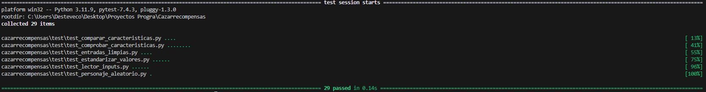

# Quién es Quién - Proyecto en Reflex de 


## Tabla de Contenidos
1. [Introducción](#introducción)
2. [Manual](#manual)
3. [Pre-requisitos](#pre-requisitos)
4. [Instalación](#instalación)
5. [Uso](#uso)
6. [Metodología](#metodología)
7. [Descripción técnica](#descripción-técnica)
8. [Requisitos funcionales y no funcionales](#requisitos-funcionales-y-no-funcionales)
9. [Historias de usuaria](#historias-de-usuaria)
10. [Arquitectura de la aplicación](#arquitectura-de-la-aplicación)
11. [Diseño](#diseño)
12. [Diagrama de Componentes](#diagrama-de-componentes)
13. [Implementación](#implementación)
14. [Tecnologías y Herramientas utilizadas](#tecnologías-y-herramientas-utilizadas)
    - [Backend](#backend)
    - [Frontend](#frontend)
15. [Pruebas](#pruebas)
    - [Coverage](#coverage)
    - [Test de unidad](#test-de-unidad)
    - [Test de integración](#test-de-integración)
16. [Análisis del tiempo invertido](#análisis-del-tiempo-invertido)
    - [Clockify + Wakatime](#clockify--wakatime)
    - [Justificación temporal](#justificación-temporal)
17. [Conclusiones](#conclusiones)
18. [Posibles mejoras](#posibles-mejoras)
19. [Dificultades](#dificultades)

---

## Introducción
Cazarrecompensas nace con la intencion de crear un juego de quien es quien para evaluar el primer trimestre de DAM en el IES de Teis de [MMSS99](https://github.com/MMSS99) y [Desteveco](https://github.com/Desteveco). En este proyecto usaremos Reflex como framework y Python para la logica.

# Manual


## Pre-requisitos
- Python3
- Git
- pip3
- Reflex Framework


## Instalación
Recomendamos utilizar un entorno virtual para instalar y manejar las dependencias del programa.
1. Crea una carpeta en tu directorio local y clona el repositorio.
2. Instala las dependencias señaladas [aqui](requirements.txt).
3. Configurar el entorno.
4. Verificación de la instalación.

## Uso


## Metodología


## Descripción técnica


## Requisitos funcionales y no funcionales


## Historias de usuario


## Arquitectura de la aplicación


## Diseño


## Diagrama de Componentes


## Implementación
### Tecnologías y Herramientas utilizadas
- Reflex
- Python
    - Pytest
- Git
- Markdown

### Backend
El backend se desarrolló utilizando el framework Reflex. Sus principales características son:
- **Gestor de preguntas y respuestas:** Con lógica para interpretar las preguntas del usuario y seleccionar una respuesta adecuada en base a las características de los personajes.
Lo primero que hacemos es lanzar el limpiador de entrada que deja la entrada de texto en minusculas y elimina espacios y signos de interrogacion
```python
    def limpiador_entrada(entrada : str):
    return (''.join(caracter for caracter in entrada.lower() if caracter.isalpha() or caracter.isspace()).strip())
```

Despues comparamos las caracteristicas del imput con nuestros diccionarios y devolvemos la clave y el valor mas adecuados.

```python
def estandarizador_claves(termino):
    for clave in SINONIMOS_CLAVES.keys():
        for sinonimo in clave:
            if termino.lower() == sinonimo:
                return SINONIMOS_CLAVES[clave]
            
def estandarizador_valores(termino):
    for clave in SINONIMOS_VALORES.keys():
        for sinonimo in clave:
            if termino.lower() == sinonimo:
                return SINONIMOS_VALORES[clave]
```
Por último 


- **Programación dirigida por eventos:** Comunicación entre el backend y el frontend mediante gestion de eventos diseñados para manejar las interacciones del juego.
- **Validación:** Comprobación de entradas del usuario para evitar errores o datos inconsistentes.

### Frontend
El frontend se implementó utilizando herramientas de Reflex Framework y otros recursos. Sus aspectos clave incluyen:
- **Interfaz interactiva:** Diseño centrado en la experiencia del usuario, con elementos gráficos para seleccionar preguntas y visualizar el progreso.
- **Gestor de eventos:** Implementación de eventos para capturar interacciones del usuario y enviar solicitudes al backend.
- **Representación de personajes:** Visualización de los personajes posibles y eliminados en cada ronda del juego.
- **Estilo:** Uso de CSS y librerías de diseño para crear una interfaz atractiva y responsiva.
- **Feedback:** Mensajes visuales que indican los resultados de cada pregunta o si el usuario ha adivinado correctamente.

## Pruebas

### Coverage

### Test de unidad

### Test de integración


## Análisis del tiempo invertido
### Clockify + Wakatime

### Justificación temporal


## Conclusiones


## Posibles mejoras
- Implementacion de una Scoreboard donde se reflejen los mejores intentos
- Seguimiento de las preguntas ya realizadas y atributos descartados para asegurar la coherencia en el juego.

## Dificultades
No hemos experimentado grandes dificultades mas allá de trabajar por primera vez con Reflex ya que no consiste en una logica elabroada, si no mas bien en algo divertido y funcional
